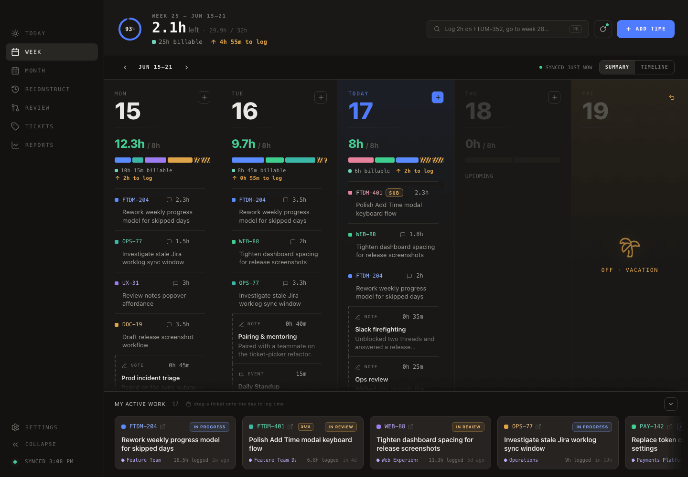
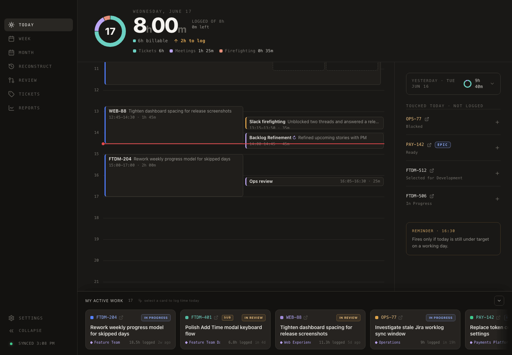
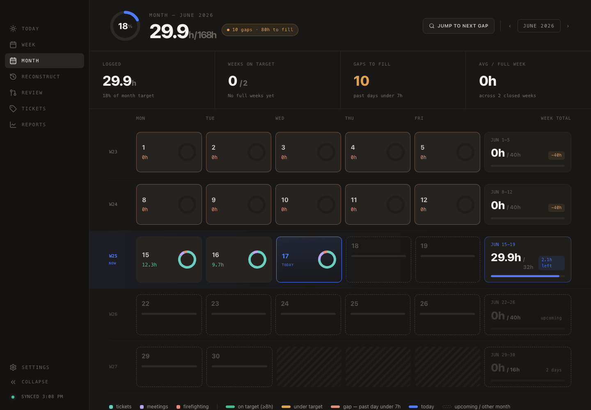
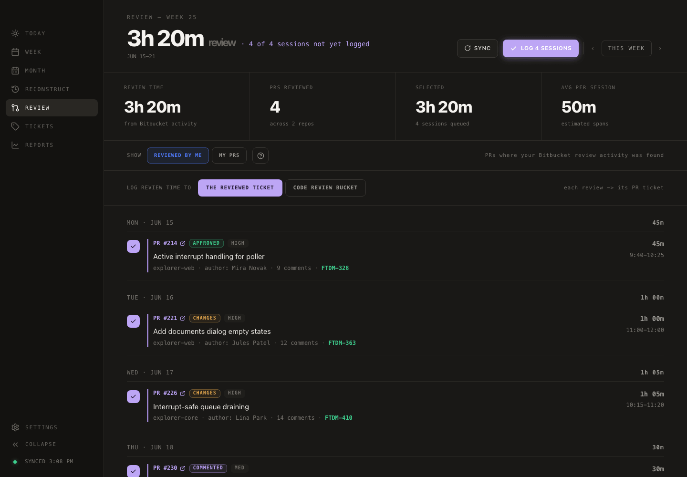
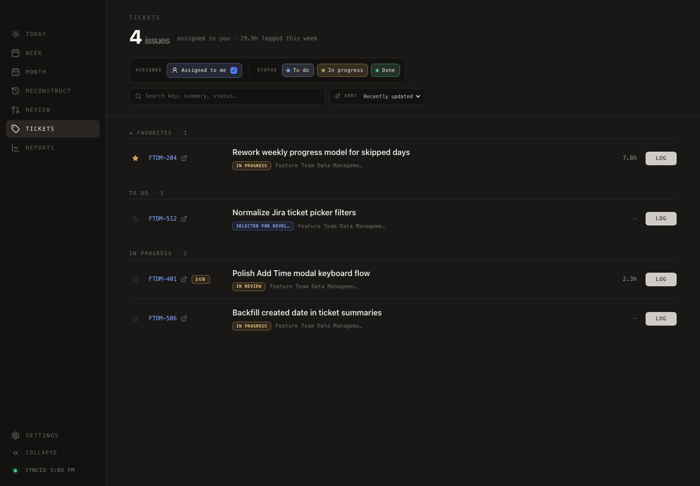
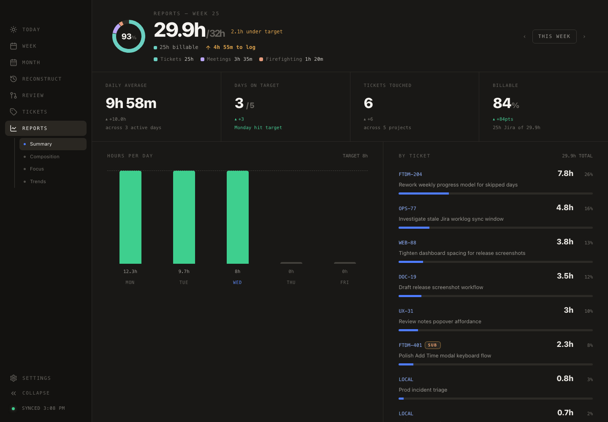
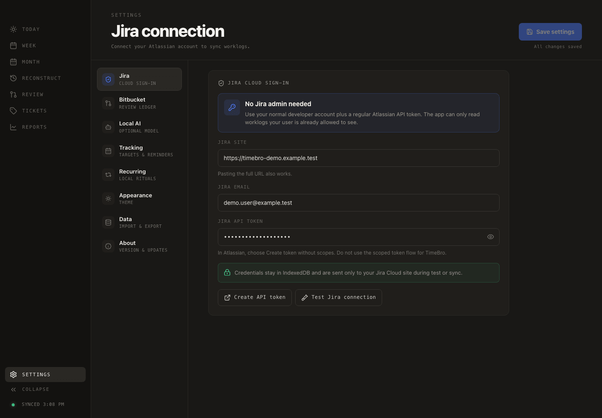
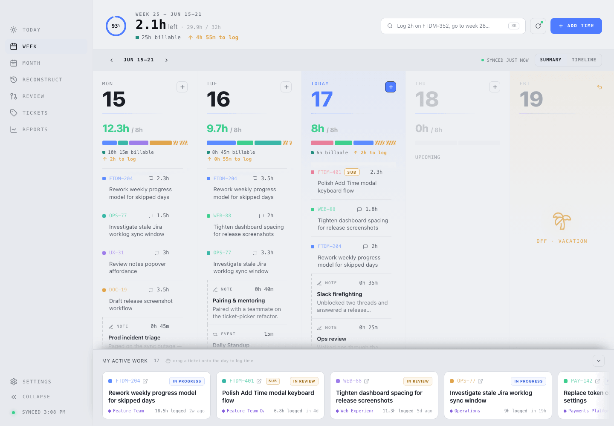

<p align="center">
  
</p>

<h1 align="center">TimeBro 🐻⏱️</h1>

<p align="center">
  <strong>Your desk buddy for Jira time tracking — so logging hours stops feeling like a chore.</strong>
</p>

<p align="center">
  
  
  
  
</p>

---

## Meet TimeBro 👋

So your manager has bravely decided that **every minute is a tiny KPI waiting to be loved.** ❤️ And now it's Friday afternoon and you're squinting at an empty Jira worklog, trying to remember what Tuesday-you actually did.

That's where TimeBro comes in. 🤝

TimeBro is a calm little desktop app that turns your messy week into a tidy cockpit: **what's logged, what's missing, which days are off, and which ticket still needs a few hours before the week closes.** Pick a ticket, tap a duration, done. Or just **drag an in-progress ticket onto a day** and watch your weekly ring fill up.

Your manager gets clean worklogs. You get your Friday back. 🎉

> 🔒 **No backend. No telemetry. No "log in with your soul."** Your data lives on your machine in plain old IndexedDB, and the only thing TimeBro ever phones is the Jira site *you* point it at.

<p align="center">
  
</p>

<p align="center">
  <em>The weekly cockpit — progress ring, per-day targets, and an Active Work dock you can drag tickets out of.</em>
</p>

---

## Why you'll like it

- ⚡ **Two-click logging.** Pick a ticket, tap `2h`, hit save. There's even a `Cmd/Ctrl-K` for the impatient.
- 🎯 **Targets that keep you honest.** Daily and weekly goals, with vacation days that quietly redistribute the rest of your week.
- 🖱️ **Drag-and-drop time.** Grab a card from the Active Work dock and drop it on any day.
- 🔍 **Log to *any* ticket.** Search all of Jira from the composer — not just the handful assigned to you.
- ✏️ **Fix mistakes.** Edit or delete worklogs right from the app.
- 👀 **Code review counts too.** Optional Bitbucket integration estimates your PR-review time and logs it for you.
- 📅 **Zoom out.** A Month calendar hunts down the days you forgot, and Reports turn it all into numbers (and CSV).
- 🌗 **Light or dark, your call.** A warm, editorial design that's easy on the eyes either way.

---

## Take the tour 🎬

### ☀️ Today — log it before you forget it

Pick a ticket (or search all of Jira), tap a duration preset, jot a note, and you're done. A **"touched today, not logged"** rail nudges you about tickets you clearly worked on but haven't logged yet, and a target bar shows exactly how much is left in the day. Prefer to keep something to yourself? Flip to **Personal note** for a local-only entry that never touches Jira.

<p align="center">
  
</p>

### 🗓️ Month — the big picture

The whole month as a calendar, color-coded by whether each day hit target. The **"jump to next gap"** button walks you straight to the days you forgot, so backfilling a sloppy month takes minutes instead of detective work.

<p align="center">
  
</p>

### 👀 Review — get credit for code review too *(optional)*

Connect Bitbucket Cloud and TimeBro estimates how long you spent reviewing each pull request from your actual review activity. Tick the sessions you want, choose whether they land on **the reviewed ticket** or a dedicated **code-review bucket**, and log them all to Jira in **one batch**. It's strictly read-only on the Bitbucket side — Jira worklogs stay the only thing TimeBro ever writes.

<p align="center">
  
</p>

### 🧩 Reconstruct — rebuild a day you forgot to track *(optional AI)*

Forgot to log a day? Open **Reconstruct** and TimeBro rebuilds it from the signals it already syncs — your Bitbucket **commits**, **PR reviews**, and the Jira time **already logged** — laid out on a 09:00→18:00 timeline. **Drag each signal onto the hour it belongs to** (or place them all at once), fine-tune any entry's duration, and watch the day add up. Step back through the last couple of weeks to catch the day you missed; today never offers hours that haven't happened yet.

It works **completely without AI**. Optionally, point it at a **local [Ollama](https://ollama.com) model** and it polishes raw `fix npe` / `wip` commit noise into clean, send-ready worklog sentences — entirely **on your machine**: no cloud, no API key, no telemetry. Off by default; the deterministic reconstruction is always the floor.

### 🏷️ Tickets — your workload, starred and sorted

Everything assigned and in progress, plus recently closed tickets and your **starred favorites**, each with a status badge, project context, hours logged this week, and a one-click **LOG** button that drops you into Today with the ticket pre-selected.

<p align="center">
  
</p>

### 📊 Reports — numbers your manager will love

Daily average, days on target, tickets touched, billable percentage, an hours-per-day chart, and a per-ticket breakdown. Browse previous weeks, then **export to CSV** for the inevitable "can you send me the spreadsheet?"

<p align="center">
  
</p>

### ⚙️ Settings — five minutes, tops

Connect Jira (and optionally Bitbucket), set your weekly target and working days, schedule a gentle end-of-day reminder, import/export your personal notes, and pick **light, dark, or auto**.

<p align="center">
  
</p>

### 🌗 Looks great in the light, too

<p align="center">
  
</p>

---

## Everything TimeBro can do

<details open>
<summary><strong>Time logging</strong></summary>

- Two-click logging with duration presets (15m → 8h) or a custom **H / D / W** picker (1d = 8h, 1w = 5d).
- Global **`Cmd/Ctrl-K`** shortcut to log time from anywhere.
- **Drag-and-drop** from the Active Work dock onto any day in the Week view.
- **Edit and delete** existing Jira worklogs (duration, start time, comment, date).
- Optional worklog comments that sync to the Jira work log item itself.
- **Personal notes** — local-only entries that count toward your totals but never touch Jira.
- Optimistic refresh: new entries show up immediately, before the next full sync.

</details>

<details>
<summary><strong>Day Reconstruction</strong> <em>(optional local AI)</em></summary>

- Rebuild a forgotten day from **Bitbucket commits + PR reviews + existing Jira worklogs**, deterministically — no model required.
- **Drag-and-drop** signals onto a 09:00→18:00 timeline, or place them all at once; re-position entries or send them back to the rail.
- **Editable durations** with a visible time span per entry; totals update live and are measured against elapsed time for today (no fabricating future hours).
- Bounded **date stepper** over the recent worklog window; the back/forward arrows never run past the editable range or into the future.
- Activity on **your own PRs** counts as work, not review; your commits are grouped by branch → ticket.
- Optional **local [Ollama](https://ollama.com)** layer drafts clean worklog prose **on-device**, with a clear AI highlight and a **Stop** control. Endpoint and pulled models are detected automatically.
- Fully local: placements, durations, and AI drafts are cached per day in IndexedDB; the model is reached only on `localhost`.

</details>

<details>
<summary><strong>Jira integration</strong></summary>

- Sign in with your Atlassian email + a regular API token — **no Jira admin required**.
- Syncs only *your* work log items, scoped to your account and the Monday-local week.
- **Search all of Jira** from the composer, not just assigned tickets.
- Assigned, in-progress, and recently-closed tickets fetched on startup (and right after you connect).
- **Status badges** (OPEN / IN PROGRESS / IN REVIEW / DONE) and issue-type badges (EPIC / SUB).
- Every ticket key is a clickable link straight to your Jira site.
- Auto-sync on launch so you open to fresh numbers.

</details>

<details>
<summary><strong>Bitbucket review ledger (optional)</strong></summary>

- Read-only Bitbucket Cloud integration that adds a **Review** screen when configured.
- Estimates review time per pull request from your real review activity.
- Filter by PRs you reviewed vs. your own PRs.
- Log review sessions to **the reviewed ticket** or a dedicated **code-review bucket**.
- Per-PR duration controls and a confirmation step before anything is written to Jira.
- Batch-log a whole week of reviews in one go.

</details>

<details>
<summary><strong>Planning &amp; insight</strong></summary>

- **Week** view: progress ring, per-day targets, vacation/skipped-day handling that redistributes your weekly goal.
- **Month** view: calendar of daily totals with a jump-to-next-gap helper.
- **Reports**: daily average, days on target, tickets touched, billable %, hours-per-day chart, by-ticket breakdown, and CSV export across your sync history.
- **Recurring** local rituals for the standups and ceremonies you log every week.

</details>

<details>
<summary><strong>Niceties</strong></summary>

- Warm editorial design in **light, dark, or auto** (follows your system).
- Collapsible sidebar and a sync-status dot you can click to refresh.
- Snackbar notifications for sync, save, and update events.
- Native reminder notifications (skipped on vacation days and completed weeks).
- In-app update checks with release notes; signed macOS and Linux AppImage builds can download and install updates directly, while Windows and package-manager Linux builds keep the installer download fallback.
- Window position and size remembered between launches.
- Responsive down to phone-width viewports.
- Import/export personal notes as CSV to move between machines.

</details>

---

## Get TimeBro

**Just want to use it?** Grab the installer for your platform from the [latest release](../../releases/latest):

- 🍎 **macOS** — `.dmg` (signed &amp; notarized) or `.zip`
- 🪟 **Windows** — `.exe` installer or `.zip`
- 🐧 **Linux** — `AppImage`, `.deb`, `.tar.gz`, or `sudo snap install timebro` after the first stable Snap Store release

Then head to **Settings → Jira** and paste in your site, email, and API token (see [Connect Jira](#connect-jira) below). That's the whole setup.

---

## Build it yourself

TimeBro is a small desktop app built with **React, TypeScript, Vite, Electron, and IndexedDB**. No backend, no telemetry, no credential relay.

```bash
npm install      # install dependencies
npm run dev      # launch the full Electron app
```

`npm run dev` starts the Vite renderer on `http://127.0.0.1:5173/`, a TypeScript watch build for Electron, and the desktop window pointed at the dev server.

```bash
npm run dev:renderer   # browser-only renderer preview
npm run build          # type-check, build renderer, compile Electron
npm run preview        # preview a production renderer build
npm run dist           # package the desktop app into release/
```

### Common commands

```bash
npm run test          # Vitest unit tests
npm run e2e:renderer  # Playwright renderer E2E against demo data
npm run lint          # type-check renderer + Electron
npm run dist:mac      # macOS DMG + ZIP
npm run dist:win      # Windows NSIS installer + ZIP
npm run dist:linux    # Linux AppImage + DEB + tar.gz
npm run dist:snap     # Linux Snap (requires Snapcraft + a build provider)
npm run screenshots   # capture release screenshots with demo data
npm audit             # check dependency advisories
```

Regenerate app icons after editing `assets/app-icon.png`:

```bash
npm run assets:icons
```

### Tech stack

React 18 · TypeScript · Vite · Electron · Vitest · Playwright · IndexedDB · Jira Cloud REST API v3 · Bitbucket Cloud REST API

### Project structure

```text
.
├── electron/      # Electron main process, preload bridge, Jira/Bitbucket calls, reminders
├── shared/        # Shared TypeScript types + ADF flattening
├── src/           # React renderer (api, app, components, demo, domain, storage, styles, utils)
├── e2e/           # Playwright renderer end-to-end tests
├── scripts/       # Icon generation + release screenshot capture
├── plans/         # Agent-maintained implementation plans
├── screenshots/   # Versioned release screenshots
├── AGENTS.md      # Agent development instructions
└── package.json   # Scripts, dependencies, Electron packaging config
```

---

## Connect Jira

For a personal local desktop app, use your Atlassian account **email + a regular Atlassian API token**. You do **not** need to be a Jira administrator.

The token acts as *you*, so Jira still enforces your normal permissions — if a project, security level, or worklog visibility rule hides something from you in Jira, the app can't see it either.

**Create a token:**

1. Open [Atlassian API tokens](https://id.atlassian.com/manage-profile/security/api-tokens).
2. Choose **Create API token** (for now, *not* the scoped-token flow).
3. Give it a label like `TimeBro`.
4. Copy the token once and paste it into **Settings → Jira** with your email.
5. Enter your site as `mycompany`, `mycompany.atlassian.net`, or `https://mycompany.atlassian.net`.

> The app uses Basic auth with Jira email + API token. Don't paste your Atlassian password.

<details>
<summary>Why a regular token instead of OAuth or scoped tokens?</summary>

OAuth 2.0 3LO is better for a distributed product with a registered Atlassian integration, consent screen, client ID/secret, redirect URL, and scopes. For this local app it's *more* setup, not less. Scoped API tokens also require Atlassian's `api.atlassian.com/ex/jira/{cloudId}` gateway with a Cloud ID, while TimeBro talks to the simpler direct Jira site URL. The code is kept open for OAuth or scoped-token gateway support later, but regular token auth is the simplest path today.

If your org *requires* scoped tokens, the read-only scopes TimeBro needs are `read:jira-work` (JQL issue search + work log items) and `read:jira-user` (`/rest/api/3/myself`, to identify your account ID so it keeps only your worklogs). Gateway support would need to be added before scoped tokens work. No write, project-management, or admin scopes are needed for read-only sync.

</details>

## Connect Bitbucket *(optional)*

Want the **Review** screen? Add a read-only Bitbucket Cloud token in **Settings → Bitbucket**:

1. Create a Bitbucket Cloud **scoped API token** and select **only read scopes**.
2. Enter your Bitbucket email, the token, your workspace, and the repositories to watch.
3. Optionally set a **code-review bucket** Jira issue key to log all review time against one ticket.
4. Hit **Test Bitbucket connection** to confirm, then **Save**.

The **Review** nav item only appears once Bitbucket is configured, and the integration never writes to Bitbucket — it only reads your review activity so it can suggest worklogs for Jira.

---

## Data &amp; privacy

- Jira and Bitbucket credentials are stored only in local **IndexedDB**.
- Credentials are sent only to the Jira/Bitbucket sites you configure, and only when testing a connection or syncing.
- **No backend server.** Sync results, skipped days, favorites, and personal notes stay on your machine.
- API calls are made by the Electron main process over IPC.
- **Local AI is on-device only.** When you enable Day Reconstruction's optional model, TimeBro talks to [Ollama](https://ollama.com) on `localhost` (default `:11434`) through the Electron main process — your commits, diffs, and ticket text are summarised locally. No cloud, no API key, no telemetry.

**IndexedDB stores:** `settings`, `weekOverrides`, `syncResults`, `favorites`, `personalNotes`, `bitbucketReviewResults`, `recurringEvents`, `recurringOccurrences`, `reconstructDrafts`, `reconstructAiDrafts`.

<details>
<summary>How the Jira work log sync actually works</summary>

TimeBro syncs Jira **work log items**, not issue discussion comments. Jira stores worklog notes on the work log item under `worklogs[*].comment` as Atlassian Document Format (ADF); the app flattens that with `shared/adf.ts`.

It identifies your account with:

```text
GET /rest/api/3/myself
```

Searches candidate issues with JQL:

```jql
worklogAuthor = currentUser()
AND worklogDate >= "<week-start>"
AND worklogDate <= "<week-end>"
ORDER BY updated DESC
```

Then fetches per-issue worklogs:

```text
GET /rest/api/3/issue/{issueIdOrKey}/worklog?startedAfter=<ms>&startedBefore=<ms>
```

For each item it uses `started` as the timestamp, `timeSpentSeconds` for math, filters by your account ID, keeps only items inside the week, reads optional notes from `comment`, and sums by day and week.

**Add Time** intentionally writes a new work log item:

```text
POST /rest/api/3/issue/{issueIdOrKey}/worklog
```

…sending `started`, `timeSpentSeconds`, and an optional ADF `comment`. (The `.../comment` endpoint is for issue discussion comments — a different Jira object — and is not used for worklog notes.)

</details>

---

## For maintainers

<details>
<summary>Release automation</summary>

Pushes to `main` run unit tests, renderer E2E, and the production build via [`.github/workflows/ci.yml`](./.github/workflows/ci.yml).

Releases are automated through [`.github/workflows/release.yml`](./.github/workflows/release.yml). Push a version tag and GitHub Actions will install deps, run tests + E2E, build, package macOS/Windows/Linux on native runners, and create/update a GitHub Release with the installers plus updater metadata (`latest*.yml` and blockmaps) attached. It uses the built-in `GITHUB_TOKEN`, so no extra release token is needed for same-repo releases.

The same workflow builds an `amd64` Snap on Ubuntu 24.04 and attaches it to the
GitHub Release. When the repository variable `SNAP_STORE_PUBLISH_ENABLED` is
`true`, tagged builds are also uploaded to the Store's `edge` channel with the
`SNAPCRAFT_STORE_CREDENTIALS` secret. Candidate and stable promotion stay
manual so the Store revision can be tested first.

**One-command version bumps:**

```bash
npm run release:dry-run   # test + e2e + build
npm run release:patch     # or release:minor / release:major
npm run release:push      # push commit + tag → starts the release workflow
```

`npm version` updates `package.json` / `package-lock.json`, commits, and tags `vX.Y.Z`. `release:push` pushes the commit and tags; the pushed tag triggers the workflow.

</details>

<details>
<summary>Snap Store packaging &amp; publishing</summary>

TimeBro uses electron-builder's `core24` Snap target with strict confinement.
The Snap has outbound network access for Jira, Bitbucket, GitHub, and Ollama;
home-directory access for CSV import/export; and the normal Electron desktop
interfaces. Snap installs manage their own updates, so the app does not offer
Snap users a GitHub `.deb` installer.

To build locally, install Snapcraft and one of its supported build providers,
then run:

```bash
npm run dist:snap
sudo snap install --dangerous release/*.snap
snap connections timebro
timebro
```

One-time Store setup:

1. Sign in with the long-term publisher account and reserve the name:

   ```bash
   snapcraft login
   snapcraft register timebro
   ```

2. Export a login restricted to TimeBro and `edge`. Set `SNAP_LOGIN_EXPIRES`
   to an ISO-8601 UTC timestamp around 90 days in the future:

   ```bash
   export SNAP_LOGIN_EXPIRES="YYYY-MM-DDTHH:MM:SSZ"
   snapcraft export-login \
     --snaps=timebro \
     --channels=edge \
     --acls=package_access,package_push,package_update,package_release \
     --expires="$SNAP_LOGIN_EXPIRES" \
     snapcraft-login.txt
   ```

3. Add the contents of `snapcraft-login.txt` as the GitHub Actions secret
   `SNAPCRAFT_STORE_CREDENTIALS`, then add the repository variable
   `SNAP_STORE_PUBLISH_ENABLED=true`.
4. Complete the listing using [`docs/snap-store-listing.md`](./docs/snap-store-listing.md).

Tagged releases go to `edge`. After installing and testing the Store revision
on Ubuntu, promote the exact revision without rebuilding it:

```bash
snapcraft revisions timebro
snapcraft release timebro <revision> candidate
snapcraft release timebro <revision> stable
```

Test both Wayland and X11. Check launch and icon integration, Jira worklog
reads/writes, Bitbucket sync, Ollama on `localhost:11434`, external links,
reminders, clipboard, CSV import/export, settings persistence across refresh,
and the Snap-managed update message.

</details>

<details>
<summary>Release screenshots</summary>

Generate deterministic light/dark screenshots for release notes and docs:

```bash
npm run screenshots
```

On a fresh machine, install the Playwright browser once if asked:

```bash
npm run screenshots:install-browser
```

The script starts the renderer on a free port, opens demo URLs like
`?demo=1&view=week&theme=dark&seed=release&today=2026-06-17`, and writes PNGs to `screenshots/v<package-version>/`. It captures `today`, `week`, `month`, `review`, `tickets`, `reports`, and `settings` in both themes. The demo data is in-memory only — it never writes fake Jira settings or worklogs into IndexedDB.

Useful overrides:

```bash
npm run screenshots -- --seed blog-1 --today 2026-06-17 --viewport 1600x1000
npm run screenshots -- --views week,reports --themes dark --out screenshots/blog-1
```

</details>

<details>
<summary>macOS code signing &amp; notarization</summary>

The release workflow signs and notarizes macOS packages with an Apple Developer ID. Add these GitHub repository secrets before pushing a release tag:

| Secret | Value |
| --- | --- |
| `MAC_CSC_LINK` | Base64-encoded `.p12` export of the **Developer ID Application** certificate + private key |
| `MAC_CSC_KEY_PASSWORD` | Password used when exporting the `.p12` |
| `APPLE_API_KEY_BASE64` | Base64-encoded App Store Connect API key `.p8` |
| `APPLE_API_KEY_ID` | App Store Connect API key ID |
| `APPLE_API_ISSUER` | App Store Connect issuer ID |
| `APPLE_TEAM_ID` | Apple Developer Team ID (e.g. `ABCDE12345`) |

Create the Developer ID certificate in Apple Developer (**Certificates, Identifiers & Profiles → Certificates → + → Software → Developer ID Application**), install the `.cer` into Keychain Access, and export it from **My Certificates** as a password-protected `.p12`.

Create the notarization key in App Store Connect (**Users and Access → Integrations → App Store Connect API → Team Keys → Generate API Key**) with the Developer role; download the `.p8` once and copy the Key ID and Issuer ID.

Encode the files before adding them as secrets:

```bash
base64 -i DeveloperIDApplication.p12 | tr -d '\n' | pbcopy
base64 -i AuthKey_XXXXXXXXXX.p8 | tr -d '\n' | pbcopy
```

Add them under **Settings → Secrets and variables → Actions → New repository secret**. Windows packages are currently unsigned.

</details>

<details>
<summary>Agent plans</summary>

Agentic development plans live in [`/plans`](./plans). If a plan changes, update the relevant file so it stays current. See [AGENTS.md](./AGENTS.md) for agent-specific instructions.

</details>

---

<p align="center"><em>Made for developers who'd rather write code than remember what they wrote. 🐻</em></p>
