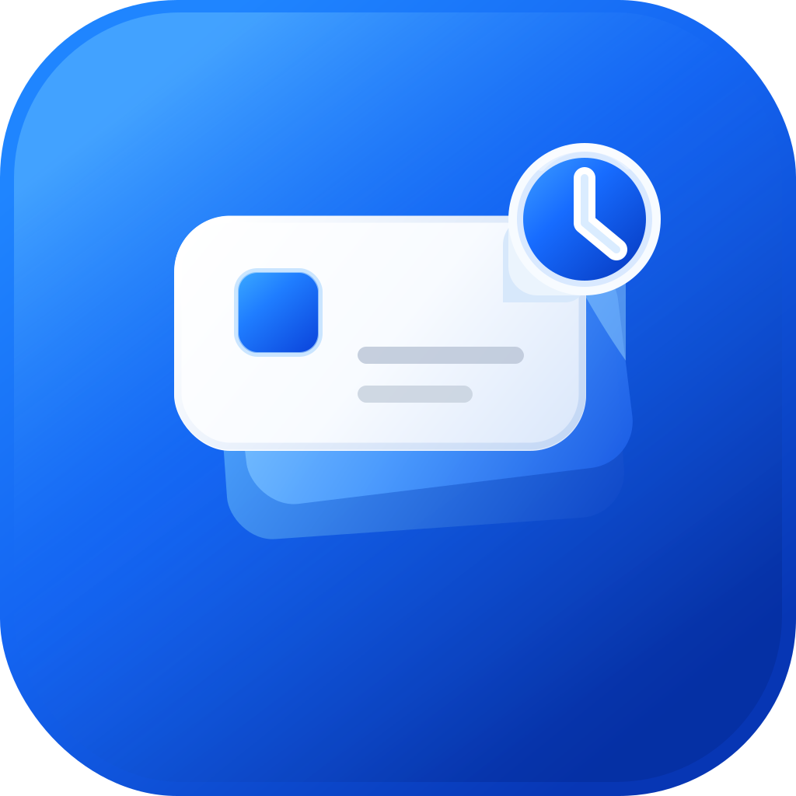

<p align="center">
  
</p>

# TimeBro

⏱️ Your manager has bravely decided that every minute is a tiny KPI waiting to be loved. If you are now searching for the perfect time-tracking instrument, TimeBro is your reliable desk buddy for keeping Jira worklogs tidy and making the manager suspiciously happy.

TimeBro turns your Jira work logs into a calm weekly cockpit: what is logged, what is missing, which days are off, and which ticket needs a little attention before the week closes.

<p align="center">
  
</p>

<p align="center">
  <em>Dark Week view: weekly progress ring, Monday-local day columns, tracked/target hours, Jira worklog rows with notes, skipped-day handling, and quick add/edit controls.</em>
</p>

TimeBro is a small desktop app built with React, TypeScript, Vite, Electron, and IndexedDB. There is no backend server, no telemetry, and no credential relay: your data stays on your machine and Jira calls go only to the Jira site you configure.

## Views

- **Today**: log time into the selected Jira ticket, pick duration presets or a custom value, add worklog notes, review today's Jira worklogs and local personal notes, and see how much remains against the daily target.
- **Week**: browse previous/current/next weeks, inspect Monday-Friday day columns, compare tracked hours to targets, mark vacation/skipped days, add or edit entries from a day, and see Jira worklog comments inline.
- **Tickets**: review assigned in-progress tickets, recently closed tickets, favorite/starred tickets, weekly logged hours by issue, epic/project context, and one-click logging.
- **Reports**: summarize weekly target progress with daily average, days on target, tickets touched, billable Jira percentage, hours-per-day charts, ticket breakdowns, and CSV export.
- **Settings**: connect Jira Cloud with email + API token, test the connection, configure weekly targets and working days, schedule local reminders, and choose light or dark theme.

## Feature Highlights

- Local-first storage for settings, week overrides, favorites, personal notes, and sync results in IndexedDB.
- Jira Cloud REST API v3 sync for your own work log items, filtered by authenticated account ID and Monday-local week bounds.
- Safe Add Time flow that intentionally creates Jira work log items with started time, duration, and optional ADF comment.
- Configurable weekly target hours, defaulting to `40h`, with working-day and skipped-day redistribution.
- Work log fidelity across API, IPC, storage, and UI: item IDs, issue keys, started timestamps, durations, and flattened ADF comments are preserved.
- Native Electron reminder notifications while the app is running, with vacation days and completed weeks respected.
- Light and dark themes, plus deterministic demo screenshots for release notes and docs.

## Tech Stack

- React 18
- TypeScript
- Vite
- Electron
- Vitest
- IndexedDB
- Jira Cloud REST API v3

## Project Structure

```text
.
├── electron/          # Electron main process, preload bridge, Jira API calls, reminders
├── shared/            # Shared TypeScript types
├── src/               # React renderer app
├── plans/             # Agent-maintained implementation plans
├── screenshots/       # Versioned release screenshots
├── AGENTS.md          # Agent development instructions
└── package.json       # Scripts, dependencies, Electron packaging config
```

## Getting Started

Install dependencies:

```bash
npm install
```

Start the full Electron app:

```bash
npm run dev
```

This starts:

- Vite renderer dev server on `http://127.0.0.1:5173/`
- Electron TypeScript watch build
- Electron desktop window pointed at the dev server

Start only the browser renderer preview:

```bash
npm run dev:renderer
```

Preview a production renderer build:

```bash
npm run build
npm run preview
```

Package the desktop app:

```bash
npm run dist
```

The packaged output is written to `release/`.

## Common Commands

```bash
npm run test      # Run Vitest tests
npm run lint      # Type-check renderer code
npm run build     # Type-check, build renderer, compile Electron files
npm run dist:mac  # Build macOS DMG and ZIP
npm run dist:win  # Build Windows NSIS installer and ZIP
npm run dist:linux # Build Linux AppImage, DEB, and tar.gz
npm run screenshots # Capture release/blog screenshots with demo data
npm audit         # Check dependency advisories
```

Regenerate app icons after editing `assets/app-icon.svg`:

```bash
npm run assets:icons
```

## Jira Sign-In: Token Or OAuth?

For a personal local desktop app, use your Atlassian account email plus a regular Atlassian API token. You do not need to be a Jira administrator.

The token acts as you, so Jira still enforces your normal permissions. Sync works when your user can browse the relevant projects and see the issues and work log items. If a project, issue security level, or work log visibility rule hides something from you in Jira, the app cannot read it either.

OAuth 2.0 3LO is better for a distributed product with a registered Atlassian integration, consent screen, client ID, client secret, redirect URL, and scopes. For this local MVP it is more setup, not less. Scoped API tokens also require the Atlassian API gateway URL with a Cloud ID, while this app uses the simpler direct Jira site URL. The app keeps the code open for OAuth or scoped-token gateway support later, but regular token auth is the simplest path right now.

## Create A Jira API Token

1. Open [Atlassian API tokens](https://id.atlassian.com/manage-profile/security/api-tokens).
2. Choose **Create API token**. For now, do not choose the scoped-token flow.
3. Give it a label such as `TimeBro`.
4. Copy the token once and paste it into the app Settings view with your Jira email.
5. Enter your Jira site as either `mycompany`, `mycompany.atlassian.net`, or `https://mycompany.atlassian.net`.

The MVP uses Basic auth with Jira email plus API token. Do not paste your Atlassian password.

If your organization requires scoped API tokens, the read-only scopes this app needs are:

- `read:jira-work` for JQL issue search and issue work log items.
- `read:jira-user` for `/rest/api/3/myself`, which identifies your Jira account ID so the app can keep only your work log items.

Scoped tokens use Atlassian's `api.atlassian.com/ex/jira/{cloudId}` gateway instead of the direct `https://company.atlassian.net` site URL, so gateway support would need to be added before scoped tokens are used in this MVP. No write, project-management, or Jira-admin scopes are needed for the current read-only sync.

## Data And Privacy

- Jira credentials are stored only in local IndexedDB.
- Credentials are sent only to the configured Jira Cloud site when testing the connection or syncing worklogs.
- No backend server is used.
- Sync results and skipped days remain local.
- Jira API calls are made by the Electron main process via IPC.

## Jira Work Log Item API

The app syncs Jira work log items, not issue discussion comments. Jira stores work log notes on the work log item itself under `worklogs[*].comment` as Atlassian Document Format (ADF). The app flattens that ADF comment with `shared/adf.ts` and keeps it on both the individual `JiraWorklog.comment` and summarized issue `comments` lists.

The app identifies the authenticated Jira account with:

```text
GET /rest/api/3/myself
```

It searches candidate issues with JQL:

```jql
worklogAuthor = currentUser()
AND worklogDate >= "<week-start-yyyy-mm-dd>"
AND worklogDate <= "<week-end-yyyy-mm-dd>"
ORDER BY updated DESC
```

It then fetches:

```text
GET /rest/api/3/issue/{issueIdOrKey}/worklog?startedAfter=<ms>&startedBefore=<ms>
```

For each returned work log item, the app:

- uses `worklog.started` as the tracking timestamp
- uses `timeSpentSeconds` for calculations
- filters by the authenticated user's Jira account ID
- includes only work log items where `started >= weekStart` and `started < weekEndExclusive`
- reads optional work log notes from `worklog.comment`
- sums tracked seconds by day and week

The Add Time flow intentionally writes a new Jira work log item with:

```text
POST /rest/api/3/issue/{issueIdOrKey}/worklog
```

That write sends Jira `started`, `timeSpentSeconds`, and an optional ADF `comment`. The app does not use `GET /rest/api/3/issue/{issueIdOrKey}/comment` for work log notes; that endpoint is for issue discussion comments, a different Jira object.

## Local Data Stores

IndexedDB stores:

- `settings`: Jira site, email, API token, weekly target, working days, reminder settings
- `weekOverrides`: skipped/vacation days by week
- `syncResults`: last calculated Jira worklog summary by week

## Agent Plans

Agentic development plans live in `/plans`. If a user changes the plan, update the relevant plan file so it stays current. See [AGENTS.md](./AGENTS.md) for agent-specific instructions.

## Release Automation

Releases are automated through [`.github/workflows/release.yml`](./.github/workflows/release.yml). Push a version tag and GitHub Actions will:

1. install dependencies
2. run tests
3. build the app
4. package macOS, Windows, and Linux builds on native runners
5. create or update a GitHub Release
6. upload the generated installers and archives

The workflow uses `gh release create` / `gh release upload` with the built-in `GITHUB_TOKEN`, so no extra release token is needed for normal same-repository releases.

## Release Screenshots

Generate deterministic light/dark screenshots for release notes, blog posts, and app store material:

```bash
npm run screenshots
```

On a fresh machine, install the Playwright browser once if the script asks for it:

```bash
npm run screenshots:install-browser
```

The script starts the renderer on a free local port, opens demo URLs such as
`?demo=1&view=week&theme=dark&seed=release&today=2026-06-17`, and writes PNGs to:

```text
screenshots/v<package-version>/
```

It captures `today`, `week`, `tickets`, `reports`, and `settings` in both dark and light themes. The data is in-memory only and does not write fake Jira settings, worklogs, tickets, or favorites into IndexedDB.

Useful overrides:

```bash
npm run screenshots -- --seed blog-1 --today 2026-06-17 --viewport 1600x1000
npm run screenshots -- --views week,reports --themes dark --out screenshots/blog-1
```

### One-Command Version Bumps

For the least manual release flow:

```bash
npm run release:dry-run
npm run release:patch
npm run release:push
```

Use `release:minor` or `release:major` instead of `release:patch` when appropriate.

`npm version` updates `package.json` and `package-lock.json`, commits the version bump, and creates a tag like `v0.1.1`. `npm run release:push` pushes both the commit and tags. The pushed tag starts the GitHub release workflow.

### Manual Tag Flow

If you want to tag manually:

```bash
git tag -a v0.1.1 -m "v0.1.1"
git push origin v0.1.1
```

Use semantic version tags in the `vX.Y.Z` format, for example `v0.2.0`.

### Local Packaging

You can build packages locally, but native CI builds are recommended for releases.

```bash
npm run dist:mac
npm run dist:win
npm run dist:linux
```

`npm run dist:all` asks electron-builder to build all configured targets from the current machine. That is convenient on machines with the right platform tooling installed, but the GitHub Actions matrix is more reliable because each OS builds its own native package.

### Code Signing

The release workflow signs and notarizes macOS packages with Apple Developer ID. Add these GitHub repository secrets before pushing a release tag:

| Secret | Value |
| --- | --- |
| `MAC_CSC_LINK` | Base64-encoded `.p12` export of the **Developer ID Application** certificate and private key |
| `MAC_CSC_KEY_PASSWORD` | Password used when exporting the `.p12` file |
| `APPLE_API_KEY_BASE64` | Base64-encoded App Store Connect API key `.p8` file |
| `APPLE_API_KEY_ID` | App Store Connect API key ID |
| `APPLE_API_ISSUER` | App Store Connect issuer ID |
| `APPLE_TEAM_ID` | Apple Developer Team ID, for example `ABCDE12345` |

Create the Developer ID certificate in Apple Developer: **Certificates, Identifiers & Profiles** -> **Certificates** -> **+** -> **Software** -> **Developer ID Application**. After installing the downloaded `.cer` into Keychain Access, export it from **My Certificates** as a password-protected `.p12`.

Create the notarization API key in App Store Connect: **Users and Access** -> **Integrations** -> **App Store Connect API** -> **Team Keys** -> **Generate API Key**. Use the Developer role, download the `.p8` file once, then copy the Key ID and Issuer ID from the same page.

Encode the local files before adding them as GitHub secrets:

```bash
base64 -i DeveloperIDApplication.p12 | tr -d '\n' | pbcopy
base64 -i AuthKey_XXXXXXXXXX.p8 | tr -d '\n' | pbcopy
```

Add the secrets in GitHub under **Settings** -> **Secrets and variables** -> **Actions** -> **New repository secret**. Windows packages are still unsigned.
