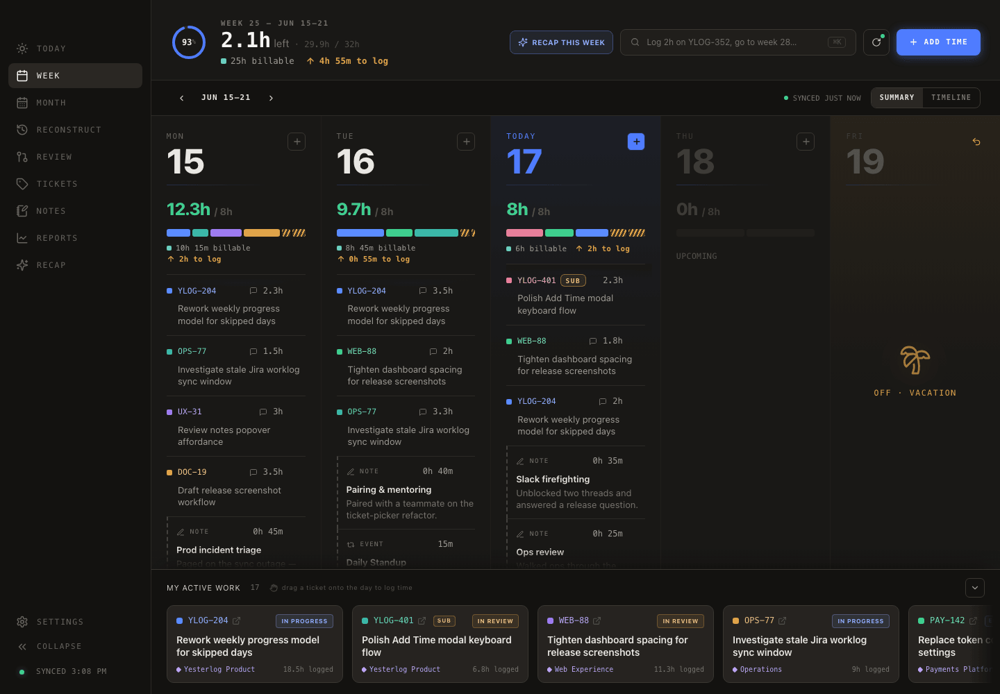

<p align="center">
  
</p>

<h1 align="center">Yesterlog ⏱️</h1>

<p align="center">
  <strong>Your work, remembered.</strong>
</p>

<p align="center">
  Reconstruct forgotten days, complete Jira worklogs, and turn your work history into useful recaps.
</p>

<p align="center">
  <a href="https://github.com/4gray/yesterlog/releases/latest"></a>
  
  
  
</p>

## Meet Yesterlog 👋

So your manager has bravely decided that **every minute is a tiny KPI waiting to be loved.** ❤️

And now it's Friday afternoon, you're staring at an empty Jira worklog, and Tuesday-you has left no forwarding address.

That's where Yesterlog comes in. 🤝

Yesterlog rebuilds the story from traces you already leave behind — Jira activity and worklogs, commits, pull-request reviews, recurring meetings, and local notes. It helps you recover missing context, complete the record, and keep evidence of the work that disappears between tickets.

Your manager gets clean worklogs. You get your Friday back — and a record of the work you'll need when review season arrives. 🎉

> No account. No Yesterlog cloud. No telemetry. Your credentials, synced activity, notes, and drafts stay on your machine.

<p align="center">
  
</p>

## From traces to proof

- **Reconstruct a day** from Jira, Bitbucket, recurring meetings, and the worklogs already recorded.
- **Complete worklogs** without treating a timer as the source of truth.
- **Write a recap** from the week or month you actually had.
- **See gaps early** before Friday turns into an archaeology project.
- **Keep review evidence** tied to concrete tickets, commits, and outcomes.
- **Stay in control** with deterministic local workflows and optional AI assistance.

[Explore the full product tour →](./docs/features.md)

## Get Yesterlog

Download the latest release for:

- **macOS:** `.dmg` or `.zip`
- **Windows:** `.exe` installer or portable `.zip`
- **Linux:** AppImage, `.deb`, `.tar.gz`, or Snap

[Download the latest release →](https://github.com/4gray/yesterlog/releases/latest)

Linux users can also install the Snap:

```bash
sudo snap install yesterlog
```

## Quick start

1. Install and launch Yesterlog.
2. Open **Settings → Jira** and enter your Jira site, email address, and regular Atlassian API token.
3. Sync your activity and start rebuilding the week.

Bitbucket and local AI are optional. The core workflow works without either.

[Read the setup guide →](./docs/getting-started.md)

## Local-first by design

- There is no Yesterlog account, hosted backend, or telemetry.
- Credentials and synced data live locally in the app's IndexedDB storage.
- Jira and Bitbucket requests go directly from the desktop app to the services you configure.
- Day Reconstruction works deterministically without AI. Optional Ollama or explicitly enabled local CLI providers only help polish drafts.

[See exactly what data Yesterlog uses →](./docs/privacy.md)

## Documentation

- [Getting started](./docs/getting-started.md)
- [Features and product tour](./docs/features.md)
- [Data and privacy](./docs/privacy.md)
- [Development](./docs/development.md)
- [Releasing](./docs/releasing.md)

## Build from source

```bash
npm install
npm run dev
```

Yesterlog is an Electron + React + TypeScript desktop app. See the [development guide](./docs/development.md) for the architecture, commands, and verification workflow.

## License

[MIT](./LICENSE)

<p align="center">
  Made for developers who would rather build than remember what they built. 🐻
</p>
